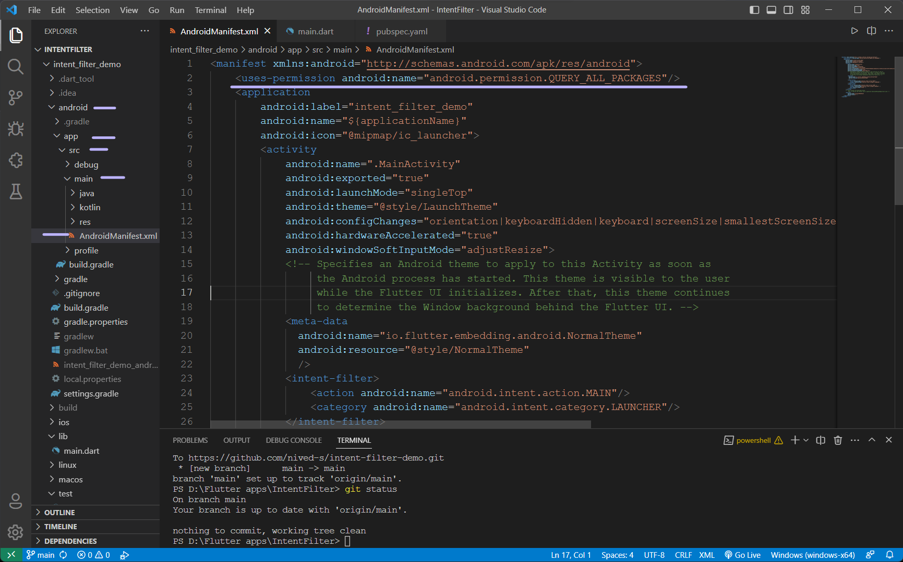

# URL Launcher Demo App

A Flutter app demonstrating how to launch a web browser using the `url_launcher` package.

## Overview

This Flutter app showcases the implementation of launching a web browser with a specific URL using the `url_launcher` package. The app includes a button that, when pressed, opens the web browser with the provided URL.

## Getting Started

### Prerequisites

- Flutter SDK: Make sure you have Flutter installed. If not, follow the official installation guide: https://flutter.dev/docs/get-started/install
- An integrated development environment (IDE) like Android Studio or Visual Studio Code is recommended.

### Installation

1. create new flutter project with flutter create:
   ```
   flutter create url_launcher_demo
   ```

2. Navigate to the project directory:
   ```
   cd url_launcher_demo
   ```

3. Install dependencies:
   official documentation of [url_launcher](https://pub.dev/packages/url_launcher/install)
   ```
   flutter pub add url_launcher
   flutter pub get
   ```

### Usage

1. Define Activities and Intent Filters
   Open the `android/app/src/main/AndroidManifest.xml` file.

   Add `<uses-permission android:name="android.permission.QUERY_ALL_PACKAGES"/>` above `<activity>`
      
   Inside of `<activity>` place `<intent-filter>`
   
2. Create Activities in Dart
   
3. Save the changes.

4. Run the app:
   ```sh
   flutter run
   ```

5. Press the "View Webpage" button in the app to launch the web browser with the specified URL.

## Dependencies

- [url_launcher](https://pub.dev/packages/url_launcher): Used to launch the web browser with a specified URL.
